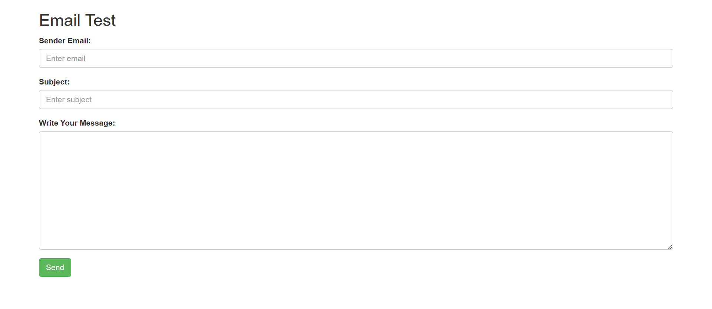

# PHPMailer – A full-featured email creation and transfer class for PHP
[](https://github.com/PHPMailer/PHPMailer/actions)
[](https://codecov.io/gh/PHPMailer/PHPMailer)
[](https://packagist.org/packages/phpmailer/phpmailer)
[](https://packagist.org/packages/phpmailer/phpmailer)
[](https://phpmailer.github.io/PHPMailer/)
[](https://api.securityscorecards.dev/projects/github.com/PHPMailer/PHPMailer)
## Features
- Probably the world's most popular code for sending email from PHP!
- Used by many open-source projects: WordPress, Drupal, 1CRM, SugarCRM, Yii, Joomla! and many more
- Integrated SMTP support – send without a local mail server
- Send emails with multiple To, CC, BCC, and Reply-to addresses
- Multipart/alternative emails for mail clients that do not read HTML email
- Support for UTF-8 content and 8bit, base64, binary, and quoted-printable encodings
- SMTP authentication with LOGIN, PLAIN, CRAM-MD5, and XOAUTH2 mechanisms over SMTPS and SMTP+STARTTLS transports
- Validates email addresses automatically
- Protects against header injection attacks
- Compatible with PHP 5.5 and later, including PHP 8.2
- Much more!

## Why you might need it
Many PHP developers need to send email from their code. The only PHP function that supports this directly is [`mail()`](https://www.php.net/manual/en/function.mail.php). However, it does not provide any assistance for making use of popular features such as encryption, authentication, HTML messages, and attachments.

Formatting email correctly is surprisingly difficult. There are myriad overlapping (and conflicting) standards, requiring tight adherence to horribly complicated formatting and encoding rules – the vast majority of code that you'll find online that uses the `mail()` function directly is just plain wrong, if not unsafe!

The PHP `mail()` function usually sends via a local mail server, typically fronted by a `sendmail` binary on Linux, BSD, and macOS platforms, however, Windows usually doesn't include a local mail server; PHPMailer's integrated SMTP client allows email sending on all platforms without needing a local mail server. Be aware though, that the `mail()` function should be avoided when possible; it's both faster and [safer](https://exploitbox.io/paper/Pwning-PHP-Mail-Function-For-Fun-And-RCE.html) to use SMTP to localhost.

## Legacy versions
PHPMailer 5.2 (which is compatible with PHP 5.0 — 7.0) is no longer supported, even for security updates. You will find the latest version of 5.2 in the [5.2-stable branch]. If you're using PHP 5.5 or later (which you should be), switch to the 6.x releases.


## A Simple Example

```php
<?php
include('smtp/PHPMailerAutoload.php');

$email = $_POST['email'];
$sub = $_POST['sub'];
$body = $_POST['msg'];

echo smtp_mailer($email, $sub, $body);
function smtp_mailer($to,$subject, $msg){
	$mail = new PHPMailer(); 
	$mail->IsSMTP(); 
	$mail->SMTPAuth = true; 
	$mail->SMTPSecure = 'tls'; 
	$mail->Host = "smtp.gmail.com";
	$mail->Port = 587; 
	$mail->IsHTML(true);
	$mail->CharSet = 'UTF-8';
	//$mail->SMTPDebug = 2; 
	$mail->Username = "mdhassan49.muh@gmail.com"; //your Email
	$mail->Password = " ";  //use google app password
	$mail->SetFrom("mdhassan49.muh@gmail.com"); 
	$mail->Subject = $subject;
	$mail->Body =$msg;
	$mail->AddAddress($to);
	$mail->SMTPOptions=array('ssl'=>array(
		'verify_peer'=>false,
		'verify_peer_name'=>false,
		'allow_self_signed'=>false
	));
	if(!$mail->Send()){
		echo $mail->ErrorInfo;
	}else{
		return 'Sent';
	}
}
?>
```
If you are re-using the instance (e.g. when sending to a mailing list), you may need to clear the recipient list to avoid sending duplicate messages. See the mailing list example for further guidance.

That's it. You should now be ready to use PHPMailer!

## Get App Password Link
 	: [Link](https://myaccount.google.com/apppasswords)

## Screenshots
<div style="position: relative;">
     
</div>

## Run Locally
Clone the project
```bash
  git clone https://github.com/muhpuc40/PhpMailer_smtp
```

## 🔗 aBOUT mE
[](https://sites.google.com/view/minhajuddinhassan/home)
[](https://www.linkedin.com/in/minhaj-uddin-hassan-78245122a?utm_source=share&utm_campaign=share_via&utm_content=profile&utm_medium=android_app)

# Thanks By Minhaj❤️❤️
